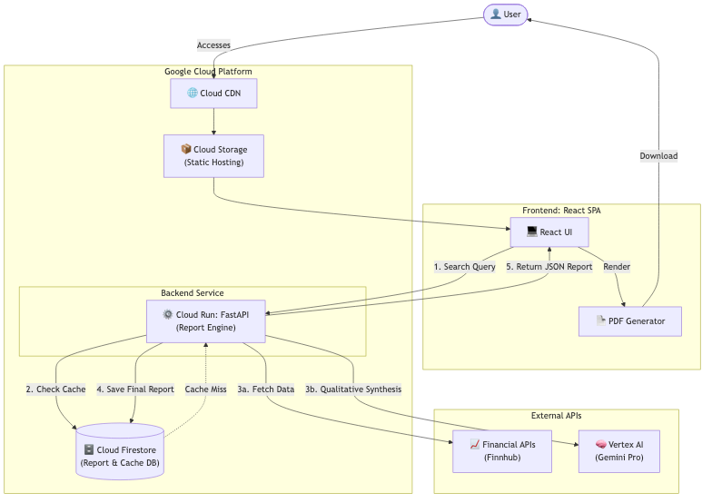

# Technical Design: Stock Research App (GCP)

## Document Overview
This document outlines the technical design for the Stock Research Application, based on the Phase 1 Functional Requirements. The system is designed to be deployed entirely on Google Cloud Platform (GCP). For each major architectural component, multiple options are presented, followed by a recommended approach and rationale.

---

## Summary Architecture Diagram



## 1. Overall Architecture & Compute

This decision dictates how the frontend user interface and the backend processing engine are structured and hosted.

### Option A: Separated SPA & Python Backend (Microservices)
*   **Frontend:** React (Vite) Single Page Application (SPA) hosted on **Cloud Storage** behind a **Cloud CDN** and Cloud Load Balancer.
*   **Backend:** Python application using FastAPI, containerized and deployed on **Cloud Run**.
*   **Pros:**
    *   **Language alignment:** Python is the undisputed king of data manipulation (Pandas) and AI/LLM integration, which is critical for the complex financial math and "Moat" analysis required.
    *   **Decoupled scaling:** The static frontend is infinitely scalable and cheap via CDN. The backend scales independently based on report generation load.
*   **Cons:** Requires managing two separate deployment pipelines and handling Cross-Origin Resource Sharing (CORS). **CORS implication:** Because the frontend and backend are hosted on different domains (e.g., `app.domain.com` and `api.domain.com`), the browser will block the frontend from calling the backend by default for security. We will need to explicitly configure the Python backend to accept requests from the frontend's origin.

### Option B: Full-Stack Next.js (Monolith)
*   **Architecture:** A single repository using Next.js for both the React UI and API routes for the backend logic. Deployed as a single container on **Cloud Run**. **Detail:** Next.js is a React framework that allows you to build full-stack web applications. In a monolith setup, the frontend UI components and backend server endpoints (API routes) live in the same codebase. When a user requests the app, the Next.js server can pre-render the UI (SSR) while securely connecting directly to the database or financial APIs from the same Node.js environment without exposing secrets. The entire app is bundled into one Docker image and hosted on Cloud Run.
*   **Pros:**
    *   Excellent developer experience with end-to-end TypeScript.
    *   Simplified deployment (one Docker container).
    *   Easy Server-Side Rendering (SSR) for fast initial loads.
*   **Cons:** Node.js/TypeScript lacks the deep ecosystem of financial data libraries (like Pandas) compared to Python, making the complex valuation math slightly more tedious to write and maintain. Additionally, heavy data processing on the Next.js backend could tie up the Node.js event loop, affecting frontend performance.

### Option C: Pure Python Full-Stack (Streamlit)
*   **Architecture:** UI and backend logic built entirely in Python using Streamlit, deployed to **Cloud Run**.
*   **Pros:** Extremely fast time-to-market. Single language (Python) for everything.
*   **Cons:** Limited UI customizability. Does not easily support a highly polished, bespoke consumer-grade interface. Can be difficult to manage complex user state compared to React.

> [!IMPORTANT]
> **Preferred Decision: Option A (Separated SPA & Python Backend)**
> **Why:** The core value of this application lies in the accuracy of its financial calculations (Windage Growth, Margin of Safety) and the synthesis of qualitative data (Moat, Management). Python's ecosystem (Pandas, Numpy, Vertex AI SDK) is vastly superior for building this "Report Engine." The slight overhead of managing two pipelines is heavily outweighed by the backend development efficiency.

---

## 2. Data Sourcing & Report Engine Logic

The report requires both hard quantitative data (10-year FCF, EPS) and soft qualitative analysis (Competitors, Moat, Sentiment).

### Option A: Hybrid (Financial API + Vertex AI)
*   **Architecture:** 
    *   **Quantitative:** Use a structured financial API. Specifically, use the **Finnhub API (https://finnhub.io/docs/api/introduction)** to fetch historical 10-year statements and company information. The Python backend performs the exact math for Payback Time and Margin of Safety.
    *   **Qualitative:** Use **Google Vertex AI (Gemini Pro)** to synthesize the "Meaning," "Moat," and "Management Quality" sections by providing it with company context and utilizing Google Search grounding.
*   **Pros:** Best of both worlds. Absolute mathematical precision for valuations (preventing LLM hallucinations), combined with powerful reasoning for subjective analysis.
*   **Cons:** Requires managing subscriptions and rate limits for third-party financial APIs.

### Option B: Pure LLM Agent with Search
*   **Architecture:** Rely entirely on an LLM Agent (Vertex AI) equipped with web search and calculator tools to find both qualitative context and quantitative historical data.
*   **Pros:** Simpler architecture (no third-party API contracts).
*   **Cons:** High risk of LLM hallucination for precise financial figures. Finding exactly 10 years of specific accounting line items (like Free Cash Flow) via search dynamically is slow and unreliable.

### Option C: Custom Data Warehouse (BigQuery)
*   **Architecture:** Ingest daily bulk data dumps from a provider (e.g., Sharadar/Quandl) into **BigQuery**. The Python backend queries BigQuery directly.
*   **Pros:** Complete control over data. Potentially lower per-query cost at a massive scale.
*   **Cons:** Massive upfront engineering effort to build ETL pipelines. Overkill for Phase 1.

> [!IMPORTANT]
> **Preferred Decision: Option A (Hybrid Financial API + Vertex AI)**
> **Why:** Financial calculations for the "Margin of Safety" must be 100% accurate and auditable by the user (as per the functional requirements). We cannot risk LLM hallucinations on numbers. Using a dedicated Financial API guarantees data integrity, while Vertex AI handles the nuanced qualitative analysis perfectly.

---

## 3. Database and Caching Strategy

We need to cache stock symbols for the autocomplete feature, and crucially, store the raw financial API responses and the computed numbers (like Windage Growth and FCF) that go into the report. Storing the final generated report itself is a secondary concern, as it can be easily regenerated on-the-fly if the underlying data and calculations are saved.

### Option A: Firestore (NoSQL)
*   **Architecture:** Use **Cloud Firestore** in Native mode.
    *   **Data Model & Keys:** Data will be organized hierarchically. The top-level collection will be `companies`, where each document's unique ID is the **Stock Ticker Symbol** (e.g., `AAPL`), allowing for instant O(1) lookups. To optimize reads and avoid downloading massive payloads unnecessarily, we will use **Subcollections** to separate heavy financial data from qualitative text.
    
    **Example Structure:**
    *   **Collection:** `companies` -> **Document:** `AAPL` (Contains basic top-level info)
        ```json
        {
          "ticker": "AAPL",
          "name": "Apple Inc.",
          "sector": "Technology",
          "industry": "Consumer Electronics",
          "subsector": "Hardware",
          "industry_group": "Technology Hardware",
          "overview": "Apple Inc. designs, manufactures, and markets smartphones, personal computers, tablets, wearables, and accessories worldwide. It sells various related services...",
          "price_at_storage": 183.25,
          "last_updated": "2026-05-03T10:00:00Z",
          "last_updated_pst": "3 May 03:00am"
        }
        ```
        *   **Subcollection:** `financials` -> **Document:** `raw_data`
            ```json
            {
              "timestamp": "2026-05-03T10:00:00Z",
              "revenue_history": [{"year": 2023, "value": 383285000000}, {"year": 2024, "value": 391000000000}],
              "operating_cash_flow_history": [{"year": 2023, "value": 110543000000}, {"year": 2024, "value": 115000000000}],
              "net_income_history": [{"year": 2023, "value": 96995000000}, {"year": 2024, "value": 100000000000}],
              "book_value_history": [{"year": 2023, "value": 62146000000}, {"year": 2024, "value": 65000000000}],
              "annual_fcf": [{"year": 2023, "value": 105.2}, {"year": 2024, "value": 110.1}],
              "annual_eps": [{"year": 2023, "value": 6.1}, {"year": 2024, "value": 6.5}],
              "roic_history": [{"year": 2023, "value": 0.34}, {"year": 2024, "value": 0.35}],
              "roe_history": [{"year": 2023, "value": 1.47}, {"year": 2024, "value": 1.54}],
              "total_debt": 111000000000,
              "cash_and_equivalents": 61555000000
            }
            ```
        *   **Subcollection:** `financials` -> **Document:** `derived_metrics`
            ```json
            {
              "timestamp": "2026-05-03T10:01:00Z",
              "growth_rates_1_3_5_10_yr": {
                "revenue": [0.02, 0.08, 0.10, 0.11],
                "operating_cash_flow": [0.04, 0.09, 0.11, 0.13],
                "net_income": [0.03, 0.07, 0.12, 0.14],
                "book_value": [0.05, 0.06, 0.08, 0.10]
              },
              "computation_growth_rates": "Calculated using CAGR formula (Ending Value / Beginning Value)^(1/Years) - 1 on the raw_data histories.",
              "windage_growth_rate": 0.12,
              "computation_windage": "Average of 10-year OCF growth rates within 1 standard deviation. Raw OCF rates: [0.15, 0.14, 0.11, 0.25 (excluded), ...]. Average of valid: 0.12",
              "computation_roic": "Sum of last 3, 5, 10 years ROIC from raw_data / N.",
              "computation_roe": "Sum of last 3, 5, 10 years ROE from raw_data / N.",
              "debt_payoff_years": 1.1,
              "computation_debt_payoff": "Total Debt (111B) / Current Annual FCF (110.1B).",
              "rule_of_40": 45.2,
              "ev_to_revenue": 8.5
            }
            ```
        *   **Subcollection:** `financials` -> **Document:** `valuations`
            ```json
            {
              "timestamp": "2026-05-03T10:02:00Z",
              "margin_of_safety_price": 59.86,
              "windage_growth_rate_used": 0.12,
              "windage_pe_used": 24,
              "marr_used": 0.15,
              "computation_mos_details": {
                "step_1_future_eps": "Current EPS (6.5) * (1 + Windage (0.12))^10 = 20.18",
                "step_2_future_price": "Future EPS (20.18) * Windage PE (24) = 484.32",
                "step_3_sticker_price": "Future Price (484.32) / (1 + MARR (0.15))^10 = 119.72",
                "step_4_mos_price": "Sticker Price (119.72) / 2 = 59.86"
              },
              "payback_time_years": 8,
              "projected_fcf_per_year": [{"year": 1, "fcf": 123}, {"year": 2, "fcf": 137}, {"year": 8, "fcf": 272}],
              "computation_payback_details": "Accumulated projected FCF reaches 1,500 by Year 8, which exceeds the current Market Cap."
            }
            ```
        *   **Subcollection:** `qualitative` -> **Document:** `sources`
            ```json
            {
              "source_links": ["https://sec.gov/aapl/10k", "https://news.ycombinator.com/item?id=..."]
            }
            ```
        *   **Subcollection:** `qualitative` -> **Document:** `growth_plans`
            ```json
            {
              "strategy_summary": "Expanding into AI hardware and services...",
              "key_initiatives": ["Apple Intelligence rollout", "Services revenue expansion"]
            }
            ```
        *   **Subcollection:** `qualitative` -> **Document:** `competitors`
            ```json
            {
              "competitor_list": [
                {
                  "name": "Samsung",
                  "competition_scope": "Direct hardware competitor in global smartphones and consumer electronics."
                },
                {
                  "name": "Microsoft",
                  "competition_scope": "Competes in enterprise services, cloud storage (iCloud vs OneDrive), and personal computing."
                }
              ]
            }
            ```
        *   **Subcollection:** `qualitative` -> **Document:** `risks`
            ```json
            {
              "key_risks": [
                {
                  "risk": "Supply chain concentration in Asia",
                  "explanation": "Heavy reliance on manufacturing partners in specific geographic regions exposes the company to geopolitical tensions, tariffs, and potential disruption from natural disasters."
                },
                {
                  "risk": "Antitrust scrutiny regarding the App Store policies",
                  "explanation": "Regulatory action forcing the company to lower App Store fees or allow third-party app stores could significantly impact its high-margin Services revenue."
                }
              ]
            }
            ```
        *   **Subcollection:** `qualitative` -> **Document:** `moats`
            ```json
            {
              "moat_types": [
                {
                  "type": "Brand",
                  "strength": "Very Strong",
                  "rationale": "Apple has massive global brand recognition and pricing power, allowing them to charge premium prices."
                },
                {
                  "type": "Switching Costs",
                  "strength": "Strong",
                  "rationale": "The iOS ecosystem (iMessage, iCloud) makes it painful for users to switch to Android."
                }
              ],
              "competitor_comparison": "Apple's ecosystem moat is significantly stronger than Samsung's purely hardware-based brand moat, resulting in higher margin retention and pricing power across global markets."
            }
            ```
        *   **Subcollection:** `qualitative` -> **Document:** `management`
            ```json
            {
              "roe_3_yr_avg": 1.50,
              "roe_5_yr_avg": 1.45,
              "roe_10_yr_avg": 1.20,
              "roic_3_yr_avg": 0.35,
              "roic_5_yr_avg": 0.32,
              "roic_10_yr_avg": 0.28,
              "ceo_tenure_years": 13,
              "ceo_employee_rating": 4.2,
              "employee_happiness_score": 4.0,
              "board_of_directors_summary": "Highly experienced board with strong tenure and backgrounds in global retail, defense, and technology."
            }
            ```
        *   **Subcollection:** `context` -> **Document:** `market_and_bias`
            ```json
            {
              "gurus_buying": ["Warren Buffett", "Bill Ackman"],
              "bias_checklist": [
                {
                  "question": "Are we outside the circle of competence?",
                  "answer": false,
                  "rationale": "Apple's business model (selling consumer electronics and software subscriptions) is easy to understand."
                },
                {
                  "question": "Is the industry declining?",
                  "answer": false,
                  "rationale": "Digital advertising continues to grow globally."
                },
                {
                  "question": "Are the Big 4 numbers failing to grow?",
                  "answer": false,
                  "rationale": "Revenue, Net Income, Book Value, and Operating Cash Flow have all grown at >10% over 10 years."
                },
                {
                  "question": "Is debt increasing?",
                  "answer": false,
                  "rationale": "Debt levels are high but covered fully by free cash flow (payoff < 3 years)."
                },
                {
                  "question": "Is EPS engineered by buybacks?",
                  "answer": false,
                  "rationale": "While buybacks exist, net income itself is growing at 12%, proving true fundamental growth."
                },
                {
                  "question": "Is demand for the product uncertain in 10 years?",
                  "answer": false,
                  "rationale": "Hardware and services demand remains highly robust globally."
                },
                {
                  "question": "Are the Big 4 numbers speeding up or slowing down?",
                  "answer": false,
                  "rationale": "Growth is slowing down slightly (from 14% to 12%) due to the law of large numbers, but remains highly consistent."
                },
                {
                  "question": "Was the CEO recently replaced?",
                  "answer": false,
                  "rationale": "Tim Cook has been CEO for over a decade."
                },
                {
                  "question": "Is there an unfriendly union?",
                  "answer": false,
                  "rationale": "Some retail unionization efforts exist, but not at a scale to threaten core corporate margins."
                },
                {
                  "question": "Have the 10-K footnotes been read?",
                  "answer": true,
                  "rationale": "Footnotes verified; no hidden off-balance-sheet liabilities detected."
                },
                {
                  "question": "Is there an event that may permanently damage the business?",
                  "answer": false,
                  "rationale": "Current antitrust lawsuits are a threat but unlikely to be an existential, permanent damage event."
                }
              ]
            }
            ```
        *   **Subcollection:** `context` -> **Document:** `growth_company_analysis` (Generated on-demand via growth-analysis endpoint)
            ```json
            {
              "generated_at": "2026-05-22T10:00:00Z",
              "cash_burn_analysis": "The cash burn is heavily skewed towards R&D and aggressive market expansion rather than structural deficits...",
              "gross_margin_analysis": "Gross margins remain high at 75%, providing strong operating leverage for future profitability...",
              "path_to_profitability": "Assuming SG&A scales logarithmically relative to revenue, they project positive OCF by 2028...",
              "runway_analysis": "With $4.2B in cash and a burn rate of $600M/yr, they have roughly 7 years of runway..."
            }
            ```
*   **Pros:**
    *   **Serverless:** Scales to zero, aligns perfectly with Cloud Run.
    *   **Schema-less:** Does not require pre-defined tables or columns. When the Python backend receives varying, deeply nested JSON responses from Finnhub (where established companies have 10 years of data but recent IPOs have 1 year), it can dump the raw JSON straight into the database as a Document without breaking a strict schema.
    *   **Real-time:** Can easily push updates to the UI if report generation takes a long time.
*   **Cons:** Complex relational queries (e.g., "find all reports where ROE > 15%") are difficult or require index planning.

### Option B: Cloud SQL (PostgreSQL)
*   **Architecture:** Managed PostgreSQL instance on **Cloud SQL**.
*   **Pros:** Excellent for structured relational data and complex querying. ACID compliance.
*   **Cons:** Higher baseline cost (always-on instance). Requires managing schema migrations. Storing large JSON reports in relational columns can be clunky compared to a document DB.

### Option C: Cloud Storage + Memorystore (Redis)
*   **Architecture:** Save the final generated reports as JSON files directly in **Cloud Storage**. Use **Memorystore (Redis)** for caching financial API responses and the autocomplete ticker list.
*   **Pros:** Cloud Storage is the cheapest way to store large files. Redis provides lightning-fast caching.
*   **Cons:** Difficult to query or filter past reports by metadata. Adds architectural complexity (managing two storage systems). Furthermore, Memorystore is highly volatile (data is stored in RAM), meaning any server restart or crash will completely wipe out the cached data, making it unsuitable for persistent storage of critical data.

> [!IMPORTANT]
> **Preferred Decision: Option A (Firestore)**
> **Why:** For Phase 1, the primary database need is storing the raw financial API responses and the computed data points. A document database like Firestore is the perfect fit for storing this deeply nested JSON data. Its serverless nature and generous free tier make it highly cost-effective for a new application. If complex relational querying is needed in Phase 2, data can be synced to BigQuery.

---

## 4. PDF / Report Generation

The user must be able to download the report.

### Option A: Frontend PDF Generation (jsPDF / html2pdf)
*   **Pros:** Zero server cost. PDF is generated entirely in the user's browser using the DOM.
*   **Cons:** Formatting can be inconsistent across different browsers. Hard to enforce strict pagination or headers/footers.

### Option B: Backend Headless Browser (Puppeteer/Playwright on Cloud Run)
*   **Pros:** Pixel-perfect PDFs that look exactly like the web UI.
*   **Cons:** Running headless Chrome inside a Cloud Run container is resource-intensive and increases latency significantly.

### Option C: Backend Markdown/HTML to PDF Library (ReportLab / WeasyPrint in Python)
*   **Pros:** Very fast, strictly controlled formatting, native to the Python backend.
*   **Cons:** Requires building a separate layout template for the PDF version distinct from the React UI.

> [!TIP]
> **Preferred Decision: Option A (Frontend Generation) OR Option C (Backend WeasyPrint)**
> **Recommendation:** Start with **Option A** for Phase 1 to minimize backend complexity. Modern frontend libraries like `@react-pdf/renderer` allow for highly customized, reliable PDF generation directly from React components without relying on basic DOM scraping. If exact branding/watermarking becomes strictly required later, we can migrate to a Python-based backend generator (Option C).

---

## 5. Async Bulk Ingestion Architecture (Phase 2)

To satisfy the Phase 2 requirement of bulk stock ingestion (up to 500 symbols per request), the system must utilize an asynchronous architecture. Processing up to 500 stock reports sequentially via a single synchronous HTTP request is impossible due to browser timeout limits (typically 2 minutes) and Cloud Run HTTP request timeouts (max 60 minutes). Furthermore, executing hundreds of financial fetches and AI analyses in rapid succession requires robust rate-limiting and retry capabilities.

### Option A: Event-Driven Queue via Google Cloud Pub/Sub (Push Subscription)
*   **Architecture:**
    1.  **Request:** The user submits up to 500 tickers in the UI.
    2.  **API Dispatch:** The FastAPI backend receives the list, validates it, and generates a unique `batch_id`. It includes the state of the "Fresh Data" toggle. It initializes an `ingestion_batches` tracking document in **Cloud Firestore** with status `pending`.
    3.  **Publishing:** The backend publishes individual messages (one per ticker symbol) to a **Cloud Pub/Sub Topic** (e.g., `stock-ingestion-topic`) with attributes containing the `ticker` and the `batch_id`.
    4.  **Async Workers:** A dedicated **Cloud Run Worker Service** is configured as a **Push Subscriber** to the Pub/Sub topic.
    5.  **Processing:** Cloud Run autoscales worker instances to process these push requests in parallel. For each ticker:
        - The worker checks if valid data exists in Firestore (unless the "Fresh Data" toggle is enabled).
        - If fetching data, the worker queries Finnhub and Vertex AI, processes 10-Ks, and runs the valuation engine. It records the current stock price and formatted PST timestamp.
        - The resulting report data is written to Firestore under the `/companies/{ticker}` collection (serving as the persistent cache).
        - The worker atomically updates the progress in the `ingestion_batches/{batch_id}` document.
    6.  **Real-Time UI:** The React frontend uses Firestore’s native **`onSnapshot` listener** to watch the `ingestion_batches/{batch_id}` document, rendering a real-time progress bar and status list.
*   **Pros:**
    *   **Highly decoupled & resilient:** If a single worker container crashes, Pub/Sub will automatically retry the message with exponential backoff.
    *   **Infinite, serverless scaling:** Cloud Run automatically scales the worker service based on queue depth, allowing parallel processing of 500 symbols across multiple containers without degrading the performance of the main web API.
    *   **Cost efficiency:** Scales to zero when no bulk imports are active.
*   **Cons:** Requires provisioning and managing a Cloud Pub/Sub topic and subscription.

### Option B: Managed Task Queue via Cloud Tasks
*   **Architecture:** The FastAPI backend creates individual tasks in a **Google Cloud Tasks Queue** targeting a specific endpoint on the backend (e.g., `/api/ingest-worker`).
*   **Pros:** Extremely strong rate-limiting controls. We can easily configure Cloud Tasks to dispatch a maximum of 5 tasks per second to avoid hitting third-party API rate limits (such as Finnhub's minute limit).
*   **Cons:** Standard Cloud Tasks integration binds tasks to specific HTTP endpoints, which can cause processing bottlenecks on the primary API instance unless a separate worker endpoint is properly isolated.

### Option C: Celery with Redis (In-Memory Worker Queue)
*   **Architecture:** Running a Celery worker pool using an in-memory broker like Redis.
*   **Pros:** Fast in-memory message delivery, well-known in the Python ecosystem.
*   **Cons:** Redis is highly volatile and expensive to host as a managed service on GCP (Memorystore Redis does not scale to zero). If the celery container crashes or restarts, all pending bulk tasks are lost.

> [!IMPORTANT]
> **Preferred Decision: Option A (Event-Driven Queue via Google Cloud Pub/Sub)**
> **Why:** Google Cloud Pub/Sub is the gold standard for serverless event-driven processing. Pairing it with a **Push Subscription to a Cloud Run Worker** allows the system to remain 100% serverless, cost-effective (scaling to zero), and extremely resilient. To handle third-party API rate limits safely, the worker code will implement standard exponential backoff retries, and the Pub/Sub push subscription can be configured with a maximum concurrency limit.
>
> Additionally, by utilizing **Cloud Firestore's real-time sync (`onSnapshot`)** for progress tracking, we completely eliminate the need for the frontend to long-poll the backend, saving CPU cycles, database reads, and bandwidth.

### 5.1 Finnhub API Rate-Limiting Strategy (Free Tier Optimization)

The Finnhub API free tier enforces a strict rate limit of **30 requests per minute**. Because processing a single stock ticker symbol can require multiple Finnhub API calls (e.g., fetching profile, financials, and historical financials separately) and a bulk batch can contain up to 500 symbols, a naive ingestion loop will instantly trigger `429 Too Many Requests` responses, failing the import.

To ensure compliance with the free tier rate limit and maximize reliability, the following multi-tiered strategy will be implemented:

#### A. Queue-Level Throttling (Cloud Tasks vs. Cloud Pub/Sub)
- **If using Cloud Tasks (Option B):** 
  - Google Cloud Tasks natively supports queue-level rate limiting. The queue will be configured with a strict `max_dispatches_per_second` limit.
  - To stay safely within the 30 requests/minute window across all concurrent calls, the queue configuration is tuned as follows:
    - **Max rate:** `0.3` dispatches/second (guarantees at most 18 tasks/minute).
    - **Max concurrent dispatches:** `1` (ensures sequential processing to avoid burst violations).
- **If using Cloud Pub/Sub (Option A):** 
  - Pub/Sub push subscriptions do not support strict minute-based rate limits natively.
  - **Workaround:** The **Cloud Run Ingestion Worker** will be restricted to `max-instances = 1` and `concurrency = 1` for the bulk import service. Inside the worker, a custom sliding-window rate-limiter or a simple token-bucket algorithm (persisted in a Firestore document `rate_limits/finnhub` to share state across instances if scaled) will delay processing to guarantee a minimum spacing of 2.0 seconds between external calls.

#### B. Application-Level Token Bucket Limiter
Inside the ingestion worker code, every call to the Finnhub API client is wrapped in a rate-limiting decorator (using libraries like `aiolimiter` or `ratelimit` in Python).
- **Configuration:** Max 25 tokens per 60 seconds (providing a safety margin under the 30-request limit).
- **Flow:** If tokens are exhausted, the async thread yields and pauses (`asyncio.sleep`) until new tokens are generated in the bucket.

#### C. Graceful Backoff & Retry Policy
To handle transient network spikes or occasional rate limit violations gracefully:
- Every external API client call will use **`tenacity`** (Python robust retry library) to automatically catch HTTP `429` status codes.
- **Retry settings:**
  - **Backoff:** Exponential backoff with jitter (starting at 5 seconds, up to 60 seconds).
  - **Special case for 429s:** If a `429` is detected, the worker will parse the `Retry-After` header if present, or dynamically execute a full sleep pause (e.g., 60 seconds) to allow the minute window to reset before attempting the retry.
  - **Max Retries:** 5 attempts before marking that specific ticker status as `failed` in Firestore.

#### Tracking Database Schema (`ingestion_batches`)
To monitor bulk execution in real-time, the system will use the following Firestore schema:
- **Collection:** `ingestion_batches`
- **Document:** `{batch_id}`
  ```json
  {
    "batch_id": "b7d8f9e0-1234-5678-abcd-1234567890ab",
    "created_at": "2026-05-19T23:38:00Z",
    "force_fresh_data": true,
    "status": "processing", // pending, processing, completed, failed
    "total_symbols": 150,
    "completed_count": 45,
    "failed_count": 2,
    "symbols": {
      "AAPL": {"status": "completed", "error": null, "timestamp": "2026-05-19T23:38:15Z"},
      "MSFT": {"status": "processing", "error": null, "timestamp": "2026-05-19T23:38:12Z"},
      "INVALID_TICKER": {"status": "failed", "error": "Finnhub API: Symbol not found", "timestamp": "2026-05-19T23:38:10Z"}
    }
  }
  ```

---

## References & Glossary

### 2. Backend Engine (Python / FastAPI)
- **Framework:** FastAPI for rapid REST API development.
- **AI Integration:** Uses Gemini (AI Studio API) to parse filings and generate insights.
- **Endpoints:**
  - `GET /api/stocks/{ticker}`: Triggers the multi-stage ingestion, analysis, and metric calculation pipeline, returning a combined JSON report.
  - `GET /api/stocks/{ticker}/growth-analysis`: Checks the database for existing growth analysis. If not found, uses Gemini to analyze growth metrics (cash burn, margins, runway, path to profitability) and saves it to the database with a timestamp.

*   **FastAPI:** A modern, incredibly fast web framework for building APIs with Python. It is highly favored for data-heavy and AI applications because it seamlessly handles complex math and integrations (like Pandas or Vertex AI) while providing automatic documentation and high performance.
*   **Node.js:** A runtime environment that allows you to execute JavaScript on a server (outside of a web browser).
*   **Next.js:** A full-stack framework built on top of Node.js and React. It takes the UI capabilities of React and adds server-side routing, database connection capabilities, and server-side rendering (SSR), making it a "batteries included" option for building full applications within a single JavaScript codebase.
*   **Vite:** A purely frontend build tool for projects like React. It bundles JavaScript React code into static assets for the browser (Client-Side Rendering) without providing backend server features, making it ideal to pair with a separate backend like Python/FastAPI.
*   **Streamlit:** An open-source Python library that makes it easy to create and share custom web apps for machine learning and data science. It allows developers to build interactive UI components directly using Python scripts, bypassing the need to write separate HTML/CSS/JavaScript. While great for rapid prototyping, it is less suited for highly customized, bespoke web experiences.
*   **Finnhub API:** A powerful stock API providing real-time and historical financial data, which will be the primary source for the quantitative metrics in our valuation models.
